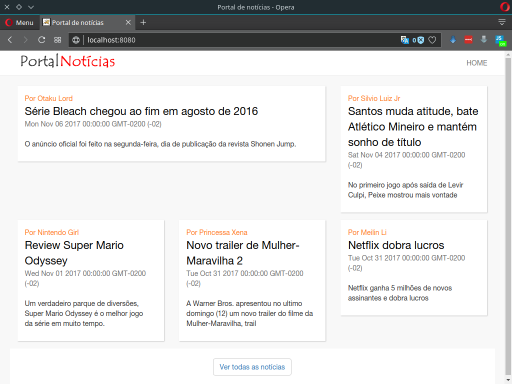
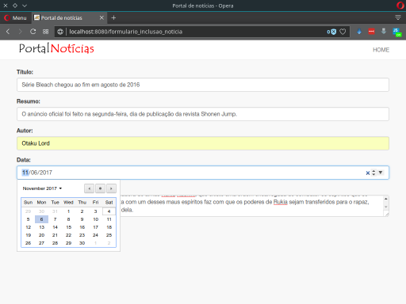
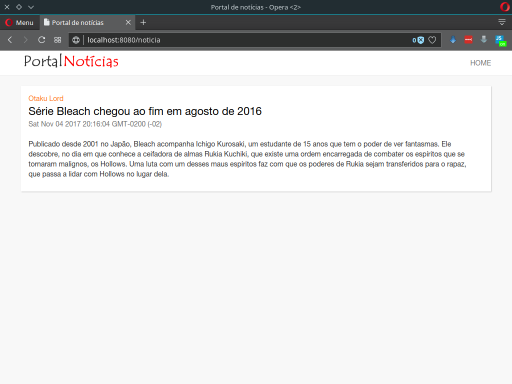
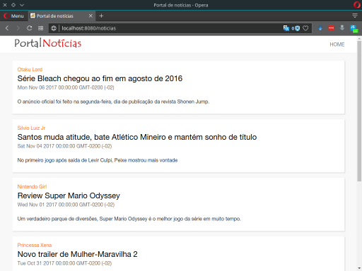

# Portal de notícias com Node

Projeto desenvolvido no módulo 1 do [Curso Completo do Desenvolvedor NodeJS e MongoDB](https://www.udemy.com/curso-completo-do-desenvolvedor-nodejs). 

Os objetos deste projeto são: 

- Introduzir os conceitos básicos do Node.js. 
- Utilizar o NPM, Express, EJS, Nodemon e CommonJS
- Exemplificar operações de CRUD com um banco de dados SQL.
- Validar dados com o Express Validator
- Entender como modularizar uma aplicação através do designer pattern MVC
- Combinar recursos estáticos com a aplicação.

Ao concluir o projeto teremos um site com páginas estáticas e dinâmicas, capaz de fazer a inclusão de novas notícias de uma maneira bem simples.

Veja abaixo alguns screenshots da aplicação rodando:

 

